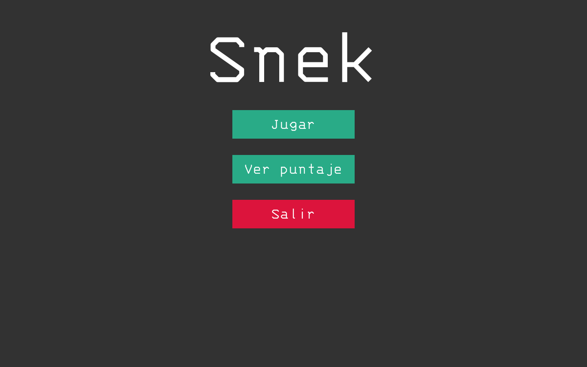
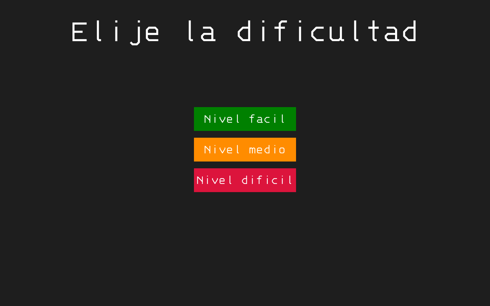
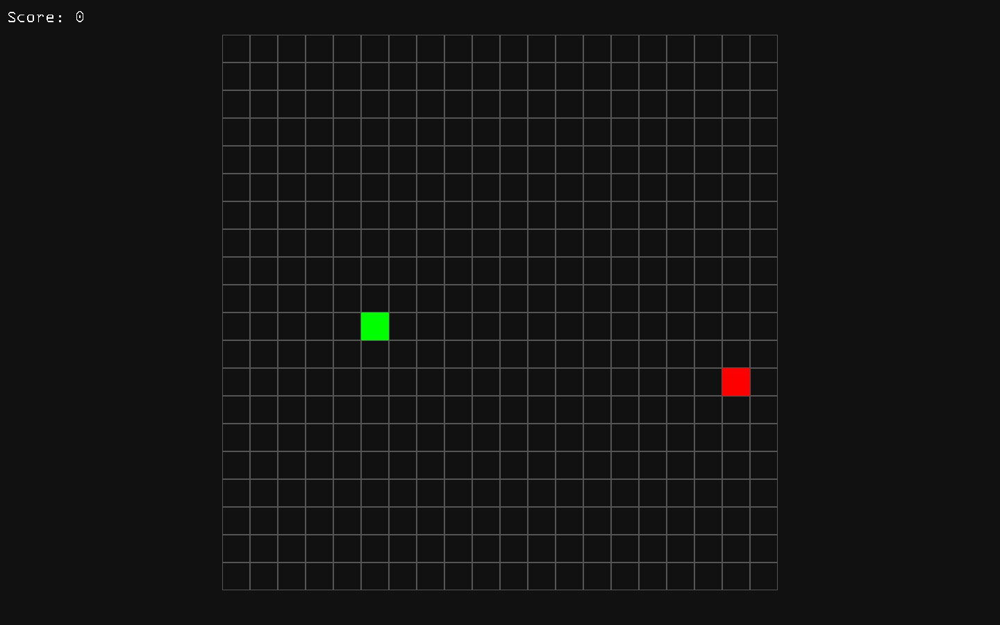
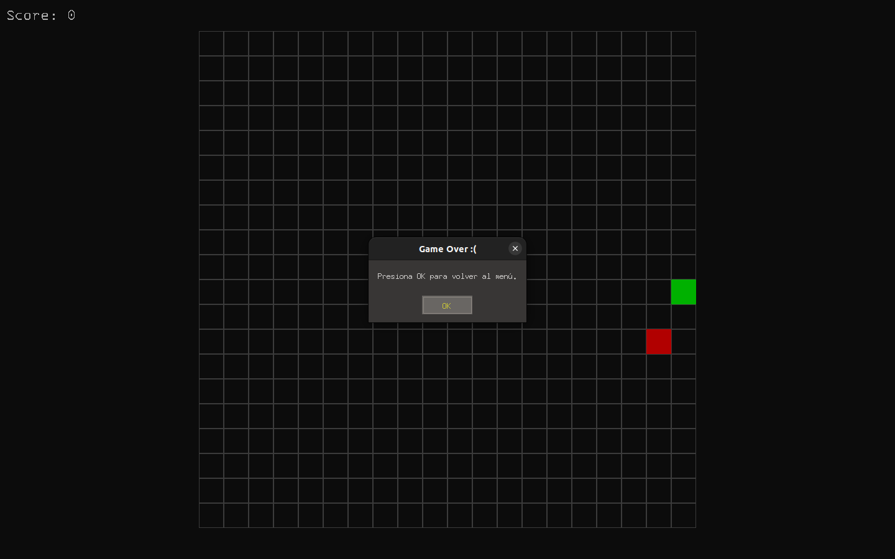

# Snek in C Project

## Descripción del proyecto:
Este proyecto se basa en una recreación del videojuego retro Snake, este fue desarrollado utilizando el lenguaje de programación C, además que se utilizó la biblioteca SDL, esta aporta bastante ayuda para gráficos y el renderizado de texto.

En el proyecto se tiene:
- Menú principal
- Selección de dificultad
- Juego de Snake funcional
- Sistema de puntaje

## Dependencias

Para este proyecto se necesita tener instalada la biblioteca SDL2 y la extensión SDL_ttf, que permite procesar la fuente seleccionada para el texto del juego. Se instalan con los siguientes comandos:

```sh
sudo apt install libsdl2-dev
sudo apt install libsdl2-ttf-dev
```

Recordar que para acceder a root se puede acceder utilizando 
```sh
su 
``` 

El archivo `.ttf` no se debe descargar, ya que viene incluido en el archivo del repositorio.

## Compilación y ejecución
1. Clonar este repositorio en tu computadora
Se clona este repo, utilizando

```sh 
git clone https://github.com/MavrosAilouros/Snake-in-C-project 
``` 

2. Se entra al directorio generado tras clonar el git
```sh
cd Snake-in-C-project/ 
``` 

3. Compilar el proyecto
Este proyecto contiene un Makefile, el cual le ahorra colocar código para compilarlo, además de darle más facilidad al usuario de poder correrlo. Para esto solamente se debe de escribir la palabra make, de la siguiente manera:

```sh
make 
``` 

4. Jugar :D
Luego de ejecutar el `make`, ya se va a obtener el ejecutable, el cual tiene el nombre de **snek** por lo cual para ejecutarlo se coloca:

```sh
./snek 
``` 

## Uso
Luego de ejecutar el juego, se va a entrar al menú, en donde se elige la opción que se desea, por ejemplo, jugar



Se le da clic en el botón de jugar y ahora aparecerá la selección del nivel de dificultad



Seguido a esto, ya se va a entrar en el juego, de manera que se observa de la siguiente manera



Cuando pierda, va a aparecer una pantalla diciendo que perdiste y que se presione OK y va a volver al menú principal



También, si se le da a la tecla ESC, aparecerá en el menú.

## Controles
Para los controles es muy sencillo, en el menú se trabaja con el mouse y los clicks, mientras que en el juego ya para manejar la serpiente se utilizan las flechas del teclado

- Flecha para arriba = Serpiente se mueve hacia arriba
- Flecha para abajo = Serpiente se mueve hacia abajo
- Flecha para la derecha = Serpiente se mueve hacia la derecha
- Flecha para la izquierda = Serpiente se mueve hacia la izquierda
